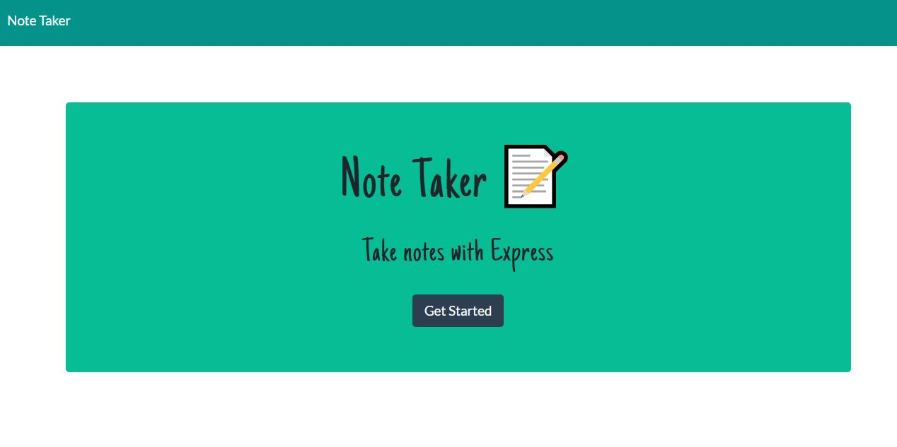
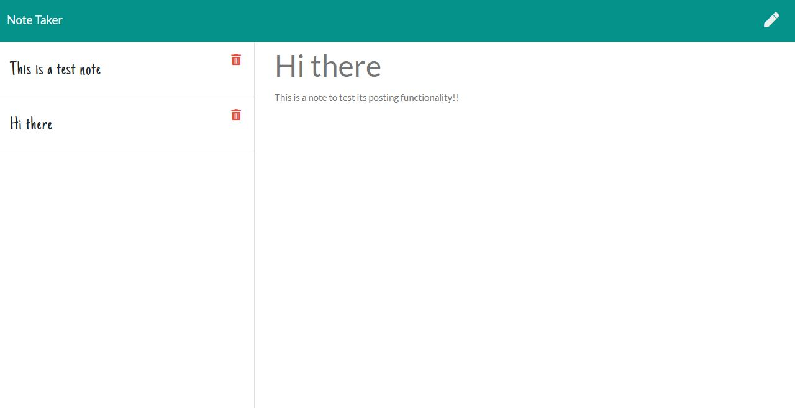

# Note-Taker

## Table of Contents
  * [Description](#description)
  * [Demo](#demo)
  * [Screenshots](#screenshots)
  * [Usage](#usage)
  * [Local Setup](#local-setup)
## Description
This application is designed using command line interface in order to create a Note Taker that can be used to write and save notes. This application will use an `Express.js` back end and will save and retrieve note data from a JSON file.

 
  ## Demo

  [Video Demonstration](https://watch.screencastify.com/v/Wa3bpi9OeEnwv67ct8Z01)

  ## Screenshots

  

  

 ## Usage

  _What this application does:_

- Application will allow user to be able to add note's title and description
- Application will allow user to be able to save the notes and won't lose them even they refresh the page

## Local-Setup

  _To set up or create locally:_

- Make sure `Node.js` is installed in your machine. If `Node.js` is not installed on your machine.

- The `package.json` file included in this Note Taker repo already lists all Node modules, NPM packages, and other dependencies that are required to successfully run this application. Please make sure to run the `npm install` command within the terminal, while in the root directory to install all required modules/packages. Then run `node server.js` to start the server, and simply navigate to this url `http://localhost:3000/` within you browser's url tab.